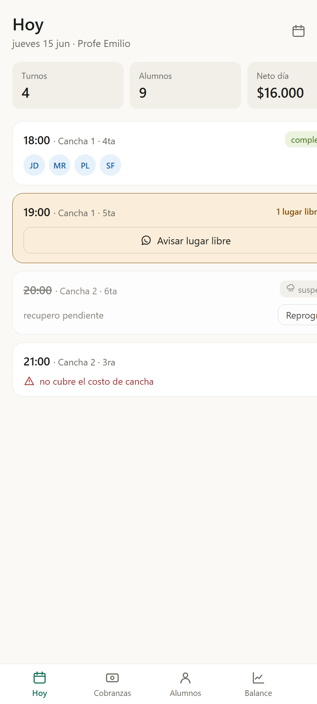
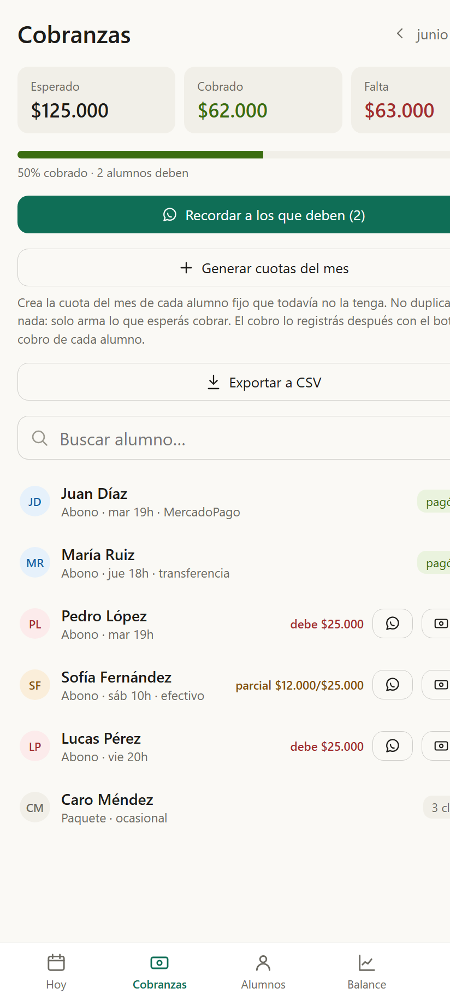
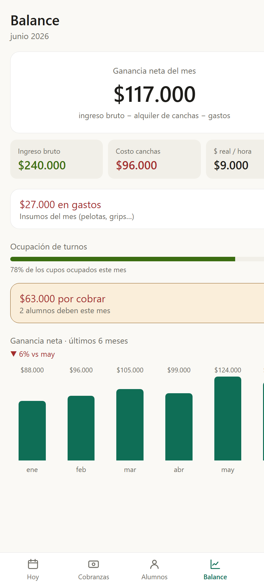

# Saque

App de gestión de clases para **profes de pádel** (y a futuro tenis). Resuelve el
día a día del profe independiente: organizar los turnos, controlar asistencia,
cobrar los abonos del mes y saber cuánto gana de verdad — usando **WhatsApp**
como canal de avisos y contemplando la realidad de pagos argentina
(MercadoPago, transferencia, efectivo).

Funciona en **web, Android e iOS** con un solo código (React + Capacitor) y un
backend de bajo costo (Supabase).

## Stack tecnológico


| Tecnología | Versión | Para qué |
| --- | --- | --- |
| **React** | 18.3 | UI por componentes |
| **TypeScript** | 5.5 | Tipado estático |
| **Vite** | 5.4 | Bundler y dev server |
| **React Router** | 6.26 | Navegación (HashRouter) |
| **Capacitor** | 6.1 | Empaquetado nativo (Android/iOS) como WebView del sitio |
| **Supabase JS** | 2.45 | Backend: Postgres + Auth + RLS |
| **PostgreSQL** | (Supabase) | Base de datos |
| **Vercel** | — | Hosting y auto-deploy en cada push |
| **Cloudflare Turnstile** | — | CAPTCHA anti-bot en el login |

## Capturas

| Hoy | Cobranzas | Balance |
| --- | --- | --- |
|  |  |  |

Más en [docs/10 · Capturas](docs/10-capturas.md).

## Cómo correr el proyecto

```bash
npm install
npm run dev
```

Abre la app en `http://localhost:5173`. Por defecto usa **datos de ejemplo**
(modo mock), así que funciona sin configurar nada. Para conectar el backend real,
copiá `.env.example` a `.env` y completá las credenciales de Supabase.

Scripts disponibles:

| Comando | Qué hace |
| --- | --- |
| `npm run dev` | Servidor de desarrollo |
| `npm run build` | Build de producción (carpeta `dist/`) |
| `npm run preview` | Sirve el build de producción |
| `npm run typecheck` | Verifica los tipos de TypeScript |

## Documentación

La carpeta [`docs/`](docs/) contiene las decisiones de producto y técnicas:

| Documento | Contenido |
| --- | --- |
| [01 · Visión y nicho](docs/01-vision-y-nicho.md) | Para quién es, qué problema resuelve y por qué |
| [02 · Modelo de datos](docs/02-modelo-de-datos.md) | Entidades, relaciones y reglas de negocio |
| [03 · Pantallas](docs/03-pantallas.md) | Las pantallas del MVP y qué hace cada una |
| [04 · Stack y costos](docs/04-stack-y-costos.md) | Tecnologías elegidas y costo de mantenimiento |
| [05 · Roadmap](docs/05-roadmap.md) | Fases del proyecto, qué entra en cada una |
| [06 · Configuración de Supabase](docs/06-supabase-setup.md) | Cómo conectar el backend real |
| [07 · Build Android](docs/07-build-android.md) | Empaquetar la app nativa con Capacitor |
| [08 · Bot de WhatsApp](docs/08-bot-whatsapp.md) | Bot reactivo y gratis (Edge Function) |
| [09 · Guía de arranque](docs/09-guia-de-arranque.md) | Guía de 1 página para el profe (primer uso) |
| [10 · Capturas](docs/10-capturas.md) | Capturas de pantalla de las pantallas principales |
| [Términos y Condiciones](docs/legal/terminos-y-condiciones.md) | Borrador legal (revisar con abogado) |
| [Política de Privacidad](docs/legal/politica-de-privacidad.md) | Borrador legal (revisar con abogado) |

## Estructura

```
src/
  components/   Componentes compartidos (layout, navegación, íconos)
  data/         Capa de datos (hoy mock; mañana Supabase)
  lib/          Utilidades (formato, WhatsApp, cliente Supabase)
  screens/      Una pantalla por sección (Hoy, Cobranzas, Alumnos, Balance)
  styles/       Tokens de diseño y estilos globales
docs/           Documentación del proyecto
```
