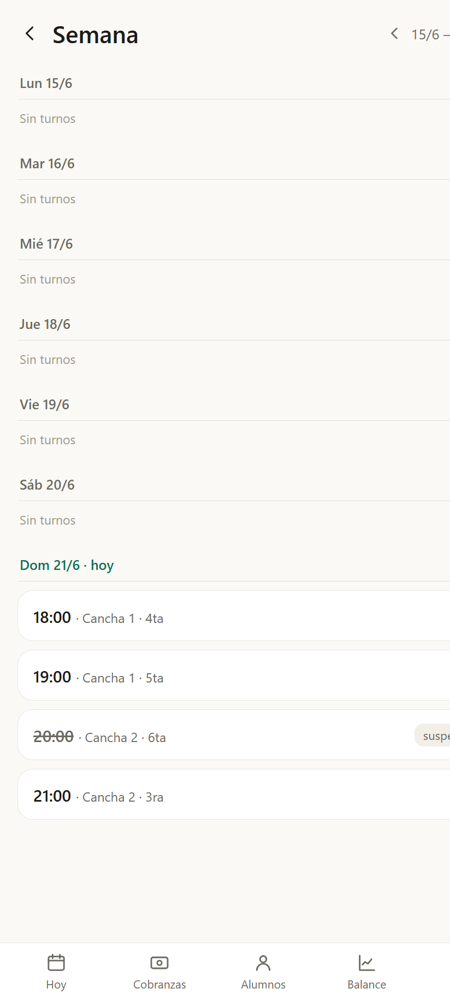
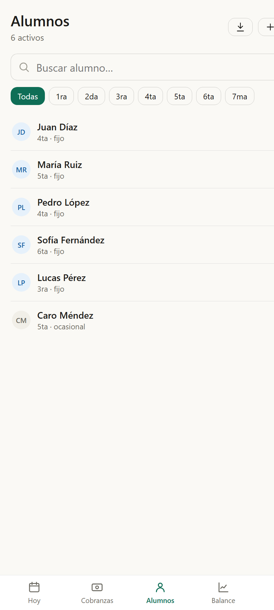
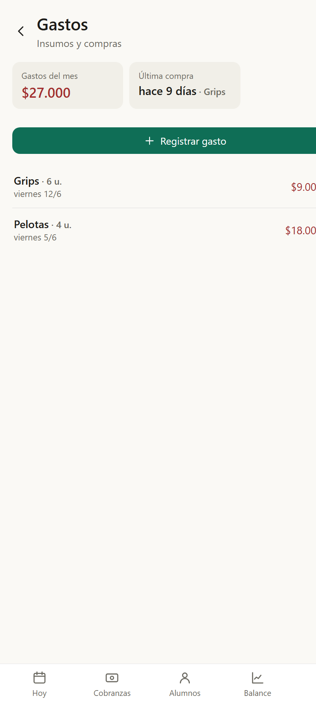

# 10 · Capturas de pantalla

Pantallas principales de Saque (con datos de ejemplo, modo claro).

| Hoy | Cobranzas |
| --- | --- |
|  |  |

| Balance | Semana |
| --- | --- |
|  |  |

| Alumnos | Gastos / insumos |
| --- | --- |
|  |  |

> Las imágenes se generan con Chrome headless sobre el build de producción en modo
> mock (datos de ejemplo). Para regenerarlas, servir el build (`npm run preview`) y
> capturar cada ruta (`/#/`, `/#/cobranzas`, etc.).
